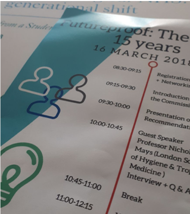

Having attended the conference today titled "Futureproof: the NHS in 15 years, a generational shift", I felt it was apt to reflect upon one of the most controversial matters raised in this student-led committee written policy.

My first question to really unravel the question would be how is the NHS and politics linked in the first place? The NHS has their budgets set by the politicians elected. The elections occur every four years and the politicians recommend in their manifesto how they will change the NHS in order to win votes.

Perhaps as highlighted in this policy, the politicians never really follow through with what they are saying, the NHS has not received the money promised to be turned over after Brexit and there are strong doubts they will never receive this. Politicians have filled us NHS workers with empty promises and therefore the policy proposes making the NHS depoliticised.

This would be done using a similar model to the monetary policy and therefore putting decisions to do with the NHS in the hands of those who lead it, the senior members of the NHS. The report iterates the perceived barrier currently the NHS faces for any change to be passed, it has to become a priority politically.

The guest speaker at the conference I went to; Professor Nicholas Mays, raised some very interesting points.  The first being that other than money distribution politics does not interfere in the NHS, they perhaps mislead the public in their empty promises and their scandalous campaigns but do not short change the NHS in anyway. He adds to this by saying the NHS is usually at the front queue in terms of budget planning for tax payer's money and whilst the service is stretched politicians cannot do anymore.

A suggestion that came to my mind was nursing and allied health professional education and the decisions made recently about bursary caps and cuts, or the junior doctor contracts. Perhaps this is the power the student-led health commission wanted more control over and sustain some stability in long -term changes rather than the short -term unfulfilled promises bought to us by every new appointed political party.
In my opinion the media is responsible for these views whereby the NHS is portrayed as stretched and burnt out when actually we are making ends meet, we do reach targets and that whilst staff shortages are occurring this hasn't necessarily been a new problem. One thing I learned from Mr Mays discussion was that the government is driven to restrict health professionals training to reduce the number of registered professionals being unemployed; which is a matter I have never considered. Maybe we are training too many nurses and doctors than there are jobs for.

To summarise, the NHS is the most trusted organisation in the country, therefore whilst politically the public is unassured by the political leaders and their decisions the NHS is still fit for purpose. The NHS shouldn't be exploited for election campaigns to win votes and there is clear need for more discussion between the political and NHS leaders in the management, priorities and decision making in the NHS. Overall, for now the NHS should not be depoliticised.

To read the full document click here í https://www.kcl.ac.uk/sspp/policy-institute/publications/Futureproofing-the-NHS-A-generational-shift.pdf

<picture>

  

</picture>

